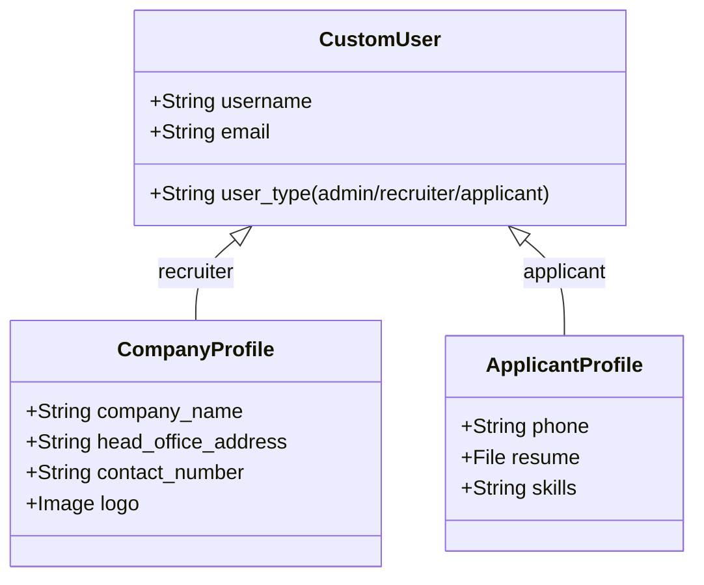
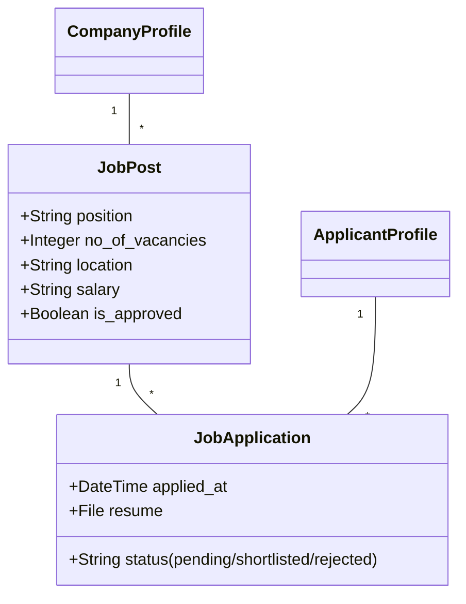

# HireHub — Project Documentation

This document provides a comprehensive overview of the HireHub platform, detailing the architecture, data models, and features for both the frontend and backend.

---

## 1. Project Overview
HireHub is a job recruitment platform that connects recruiters with applicants. It features a modern Flutter UI for users and a robust Django backend for managing data and authentication.

### Key Features
- **User Authentication**: Secure login/registration with OTP verification.
- **Job Listings**: Dynamic grid view of available jobs with search and filtering.
- **Recruiter Dashboard**: Manage company profiles and job postings.
- **Applicant Dashboard**: Browse jobs, track applications, and manage profiles.
- **Modern UI/UX**: Premium design with masonry layouts, custom fonts, and smooth animations.

---

## 2. Backend Architecture (Django)
The backend is built using Django and Django REST Framework (DRF).

### Core Applications
- `adminpanel`: Handles custom user models, authentication, OTP verification, and platform settings.
- `moderator`: Manages job posts, company profiles, applicant profiles, and applications.

### Data Models

#### User & Profile Models

#### Job & Application Models

### API Endpoints (Core)
| Endpoint | Method | Description |
| :--- | :--- | :--- |
| `/adminpanel/api/login/` | POST | Authenticate user and receive token |
| `/adminpanel/api/register/` | POST | Register a new user |
| `/api/jobs/` | GET/POST | List or create job posts |
| `/api/applications/` | GET/POST | Manage job applications |
| `/api/applicant/profile/` | GET/PATCH | Manage applicant profile |

---

## 3. Frontend Architecture (Flutter)
The frontend is a cross-platform Flutter application (Mobile & Web).

### UI Components
- **HeroSearchBar**: A modern, interactive search bar with filtering options.
- **JobGridCard**: A premium card design for displaying job summaries.
- **CategoryScroll**: Horizontal scrolling category selector.

### Key Screens
- **DashboardScreen**: The main entry point displaying featured jobs and search.
- **ApplicantDashboardScreen**: Personal area for applicants to track status.
- **JobDetailScreen**: Detailed view of a job post with application functionality.
- **Login/Register Screens**: Integrated OTP verification flow.

### State & Service Management
- **ApiService**: A singleton class using `Dio` for all backend interactions.
- **FlutterSecureStorage**: Used for storing sensitive authentication tokens.
- **SharedPreferences**: Used for non-sensitive local data (user settings, etc.).

---

## 4. Setup & Deployment

### Local Development
Refer to the [README.md](file:///d:/PROJECTS/hirehub/README.md) for step-by-step setup instructions.

### Production
- **Backend**: Hosted on PythonAnywhere.
- **Database**: SQLite (Development) / PostgreSQL (Production recommendation).
- **Environment Variables**: Managed via `.env` files and secure secrets storage.

---

## 5. Recent UI Enhancements
- **Modern Typography**: Integrated Inter, Relevance, and Brandink Sans fonts.
- **Advanced Layouts**: Implemented `MasonryGridView` for a dynamic job listing feel.
- **Polished Visuals**: Added gradients, micro-animations, and improved spacing.
- **Location Support**: Integrated `geolocator` and `geocoding` for location-aware job searching.

---
*Documentation updated: May 2026*
